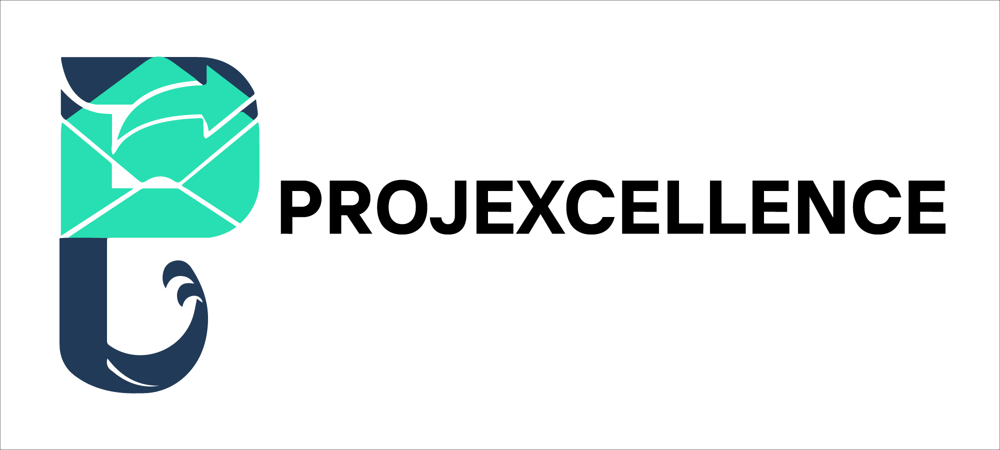

# PROJEXCELLENCE

<h1 align="center">
  <br />
  <span style="font-size: 2em; font-weight: bold;">PROJECT MANAGEMENT SYSTEM</span>
</h1>

## Project Resources

- [Entity Relationship Diagram (ERD)](https://lucid.app/lucidchart/7184a18b-28d4-4e22-86b0-8e0adb78c6c6/edit?viewport_loc=-1399%2C-424%2C2164%2C1097%2C0_0&invitationId=inv_15926259-afeb-4959-8274-8b43f0a902c1) (Deprecated)
- [Figma Prototype](https://www.figma.com/design/Ejn0kA6AoDekfoNpKFUWXq/IM2?node-id=0-1&t=wTeiojp3ZGKXDLTL-1)
- [Gantt Chart](https://docs.google.com/spreadsheets/d/1QTl-HRuxibmfoPrlHXM7rtjF6_c43Y9-kxwVyI9Ik6k/edit?usp=sharing)
- [Project Requirements](https://docs.google.com/document/d/1nWzAiBxbicxQGC9QtIwUru9vspHINHGE5XID0jx5WNI/edit?usp=sharing)

## Team Members

- **zincaid (Lanz Roy Sumalpong)** -Project Manager / Designer / Front-end / Tester
- **Sting421 (Aldrin John Vitorillo)** -Full-stack Developer
- **Raveneko (Mary Apple Ramos)** -Designer & Front-end / Tester


## How to clone

1. **Clone the repository**  
   ```bash
   git clone https://github.com/Sting421/PROJEXCELLENCE.git
   ```

2. **Go to the project directory**  
   ```bash
   cd PROJEXCELLENCE
   ```

3. **Install dependencies**  
   ```bash
   pip install -r requirements.txt
   ```

4. **Set up the database**  

   ```bash
   python manage.py makemigrations
   python manage.py migrate
   ```

5. **Run the application**
    ```bash
    python manage.py runserver
    ```

## Technologies Used
- Frontend: HTML, CSS, BOOTSTRAP, JAVASCRIPT, DJANGO-TEMPLATES
- Backend: DJANGO
- Database: SQLITE
- Other tools: CRISPY, DJANGO-FILTER, PILLOW, RUFF


